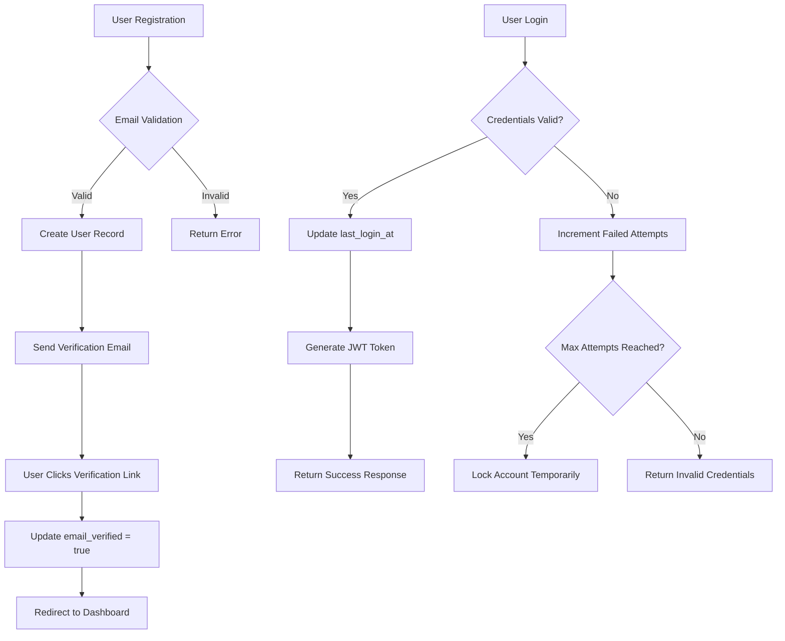
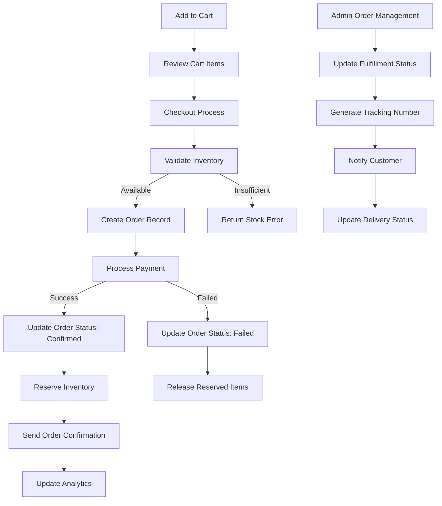
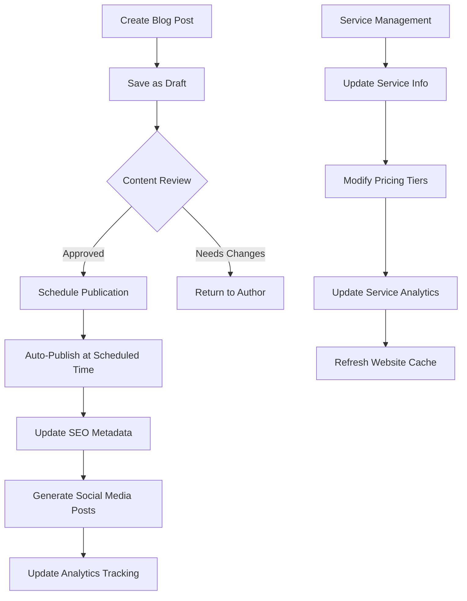
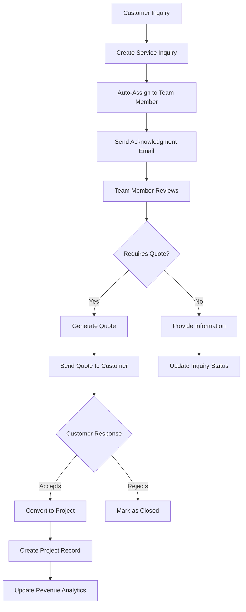

# Database Schema for Nano Computing Website

## Overview
This document outlines the complete database schema for the Nano Computing website, including all tables, relationships, indexes, stored procedures, and other database objects required for production deployment.

## Database Structure

### Core Tables

#### 1. Users Table
```sql
CREATE TABLE users (
    id UUID PRIMARY KEY DEFAULT gen_random_uuid(),
    email VARCHAR(255) UNIQUE NOT NULL,
    password_hash VARCHAR(255) NOT NULL,
    first_name VARCHAR(100) NOT NULL,
    last_name VARCHAR(100) NOT NULL,
    phone VARCHAR(20),
    role ENUM('admin', 'customer', 'team_member') DEFAULT 'customer',
    is_active BOOLEAN DEFAULT true,
    email_verified BOOLEAN DEFAULT false,
    last_login_at TIMESTAMP,
    created_at TIMESTAMP DEFAULT CURRENT_TIMESTAMP,
    updated_at TIMESTAMP DEFAULT CURRENT_TIMESTAMP ON UPDATE CURRENT_TIMESTAMP
);
```
**Purpose**: Stores user authentication and basic profile information for customers, admins, and team members.

#### 2. Products Table
```sql
CREATE TABLE products (
    id UUID PRIMARY KEY DEFAULT gen_random_uuid(),
    name VARCHAR(255) NOT NULL,
    description TEXT,
    price DECIMAL(10,2) NOT NULL,
    compare_at_price DECIMAL(10,2),
    category ENUM('networking', 'storage', 'security', 'accessories', 'servers', 'software') NOT NULL,
    sku VARCHAR(100) UNIQUE NOT NULL,
    features JSON,
    specifications JSON,
    images JSON,
    badge_variant ENUM('new-arrival', 'popular', 'best-seller', 'high-performance', 'enterprise', 'security'),
    badge_color VARCHAR(7),
    rating DECIMAL(2,1) DEFAULT 0,
    review_count INT DEFAULT 0,
    in_stock BOOLEAN DEFAULT true,
    stock_quantity INT DEFAULT 0,
    tags JSON,
    is_active BOOLEAN DEFAULT true,
    seo_title VARCHAR(255),
    seo_description TEXT,
    created_at TIMESTAMP DEFAULT CURRENT_TIMESTAMP,
    updated_at TIMESTAMP DEFAULT CURRENT_TIMESTAMP ON UPDATE CURRENT_TIMESTAMP
);
```
**Purpose**: Stores all product information including pricing, inventory, and SEO metadata.

#### 3. Services Table
```sql
CREATE TABLE services (
    id UUID PRIMARY KEY DEFAULT gen_random_uuid(),
    title VARCHAR(255) NOT NULL,
    description TEXT,
    short_description VARCHAR(500),
    icon VARCHAR(50),
    type ENUM('consultation', 'implementation', 'maintenance', 'support') NOT NULL,
    features JSON,
    image VARCHAR(255),
    gallery JSON,
    is_popular BOOLEAN DEFAULT false,
    is_visible BOOLEAN DEFAULT true,
    display_order INT DEFAULT 0,
    seo_title VARCHAR(255),
    seo_description TEXT,
    seo_keywords JSON,
    created_at TIMESTAMP DEFAULT CURRENT_TIMESTAMP,
    updated_at TIMESTAMP DEFAULT CURRENT_TIMESTAMP ON UPDATE CURRENT_TIMESTAMP
);
```
**Purpose**: Manages service offerings with pricing tiers and marketing information.

#### 4. Service Pricing Table
```sql
CREATE TABLE service_pricing (
    id UUID PRIMARY KEY DEFAULT gen_random_uuid(),
    service_id UUID NOT NULL,
    tier VARCHAR(100) NOT NULL,
    price DECIMAL(10,2) NOT NULL,
    currency VARCHAR(3) DEFAULT 'ETB',
    billing_period ENUM('one-time', 'monthly', 'yearly') DEFAULT 'one-time',
    features JSON,
    is_popular BOOLEAN DEFAULT false,
    is_visible BOOLEAN DEFAULT true,
    created_at TIMESTAMP DEFAULT CURRENT_TIMESTAMP,
    FOREIGN KEY (service_id) REFERENCES services(id) ON DELETE CASCADE
);
```
**Purpose**: Stores different pricing tiers for each service with feature lists.

#### 5. Blog Posts Table
```sql
CREATE TABLE blog_posts (
    id UUID PRIMARY KEY DEFAULT gen_random_uuid(),
    title VARCHAR(255) NOT NULL,
    slug VARCHAR(255) UNIQUE NOT NULL,
    excerpt TEXT,
    content LONGTEXT,
    author_id UUID NOT NULL,
    category_id UUID,
    featured_image VARCHAR(255),
    status ENUM('draft', 'scheduled', 'published', 'archived') DEFAULT 'draft',
    published_at TIMESTAMP,
    scheduled_at TIMESTAMP,
    read_time INT,
    view_count INT DEFAULT 0,
    share_count INT DEFAULT 0,
    seo_title VARCHAR(255),
    seo_description TEXT,
    seo_keywords JSON,
    created_at TIMESTAMP DEFAULT CURRENT_TIMESTAMP,
    updated_at TIMESTAMP DEFAULT CURRENT_TIMESTAMP ON UPDATE CURRENT_TIMESTAMP,
    FOREIGN KEY (author_id) REFERENCES users(id),
    FOREIGN KEY (category_id) REFERENCES blog_categories(id)
);
```
**Purpose**: Content management for blog posts with SEO optimization and publishing workflow.

#### 6. Orders Table
```sql
CREATE TABLE orders (
    id UUID PRIMARY KEY DEFAULT gen_random_uuid(),
    order_number VARCHAR(50) UNIQUE NOT NULL,
    customer_id UUID NOT NULL,
    customer_info JSON NOT NULL,
    subtotal DECIMAL(10,2) NOT NULL,
    tax DECIMAL(10,2) DEFAULT 0,
    shipping DECIMAL(10,2) DEFAULT 0,
    total DECIMAL(10,2) NOT NULL,
    status ENUM('pending', 'confirmed', 'processing', 'shipped', 'delivered', 'cancelled', 'refunded') DEFAULT 'pending',
    payment_status ENUM('pending', 'paid', 'failed', 'refunded', 'partially_refunded') DEFAULT 'pending',
    fulfillment_status ENUM('unfulfilled', 'partial', 'fulfilled', 'shipped', 'delivered') DEFAULT 'unfulfilled',
    notes TEXT,
    tracking_number VARCHAR(100),
    estimated_delivery DATE,
    created_at TIMESTAMP DEFAULT CURRENT_TIMESTAMP,
    updated_at TIMESTAMP DEFAULT CURRENT_TIMESTAMP ON UPDATE CURRENT_TIMESTAMP,
    FOREIGN KEY (customer_id) REFERENCES users(id)
);
```
**Purpose**: E-commerce order management with status tracking and customer information.

### Analytics & Performance Tables

#### 7. Service Analytics Table
```sql
CREATE TABLE service_analytics (
    id UUID PRIMARY KEY DEFAULT gen_random_uuid(),
    service_id UUID NOT NULL,
    period ENUM('daily', 'weekly', 'monthly', 'yearly') NOT NULL,
    date DATE NOT NULL,
    view_count INT DEFAULT 0,
    inquiry_count INT DEFAULT 0,
    conversion_rate DECIMAL(5,4) DEFAULT 0,
    average_response_time DECIMAL(8,2),
    customer_satisfaction DECIMAL(2,1),
    revenue_generated DECIMAL(12,2) DEFAULT 0,
    created_at TIMESTAMP DEFAULT CURRENT_TIMESTAMP,
    FOREIGN KEY (service_id) REFERENCES services(id) ON DELETE CASCADE,
    UNIQUE KEY unique_service_period_date (service_id, period, date)
);
```
**Purpose**: Tracks service performance metrics for business intelligence.

## Indexes for Performance

```sql
-- User indexes
CREATE INDEX idx_users_email ON users(email);
CREATE INDEX idx_users_role ON users(role);
CREATE INDEX idx_users_active ON users(is_active);

-- Product indexes
CREATE INDEX idx_products_category ON products(category);
CREATE INDEX idx_products_active ON products(is_active);
CREATE INDEX idx_products_price ON products(price);
CREATE INDEX idx_products_rating ON products(rating);
CREATE INDEX idx_products_stock ON products(in_stock);

-- Order indexes
CREATE INDEX idx_orders_customer ON orders(customer_id);
CREATE INDEX idx_orders_status ON orders(status);
CREATE INDEX idx_orders_date ON orders(created_at);
CREATE INDEX idx_orders_number ON orders(order_number);

-- Blog indexes
CREATE INDEX idx_blog_status ON blog_posts(status);
CREATE INDEX idx_blog_published ON blog_posts(published_at);
CREATE INDEX idx_blog_author ON blog_posts(author_id);
CREATE INDEX idx_blog_slug ON blog_posts(slug);

-- Analytics indexes
CREATE INDEX idx_analytics_service_date ON service_analytics(service_id, date);
CREATE INDEX idx_analytics_period ON service_analytics(period, date);
```

## Stored Procedures

### 1. User Management
```sql
DELIMITER //
CREATE PROCEDURE CreateUser(
    IN p_email VARCHAR(255),
    IN p_password_hash VARCHAR(255),
    IN p_first_name VARCHAR(100),
    IN p_last_name VARCHAR(100),
    IN p_role ENUM('admin', 'customer', 'team_member')
)
BEGIN
    DECLARE user_exists INT DEFAULT 0;
    
    SELECT COUNT(*) INTO user_exists FROM users WHERE email = p_email;
    
    IF user_exists = 0 THEN
        INSERT INTO users (email, password_hash, first_name, last_name, role)
        VALUES (p_email, p_password_hash, p_first_name, p_last_name, p_role);
        
        SELECT LAST_INSERT_ID() as user_id, 'success' as status;
    ELSE
        SELECT 0 as user_id, 'email_exists' as status;
    END IF;
END //
DELIMITER ;
```

### 2. Order Processing
```sql
DELIMITER //
CREATE PROCEDURE ProcessOrder(
    IN p_customer_id UUID,
    IN p_items JSON,
    IN p_customer_info JSON
)
BEGIN
    DECLARE v_order_id UUID;
    DECLARE v_order_number VARCHAR(50);
    DECLARE v_subtotal DECIMAL(10,2) DEFAULT 0;
    DECLARE v_tax DECIMAL(10,2) DEFAULT 0;
    DECLARE v_total DECIMAL(10,2) DEFAULT 0;
    
    -- Generate order number
    SET v_order_number = CONCAT('NC-', DATE_FORMAT(NOW(), '%Y%m%d'), '-', LPAD(FLOOR(RAND() * 10000), 4, '0'));
    SET v_order_id = UUID();
    
    -- Calculate totals (simplified)
    SET v_subtotal = JSON_UNQUOTE(JSON_EXTRACT(p_items, '$.subtotal'));
    SET v_tax = v_subtotal * 0.15; -- 15% tax
    SET v_total = v_subtotal + v_tax;
    
    -- Insert order
    INSERT INTO orders (id, order_number, customer_id, customer_info, subtotal, tax, total)
    VALUES (v_order_id, v_order_number, p_customer_id, p_customer_info, v_subtotal, v_tax, v_total);
    
    SELECT v_order_id as order_id, v_order_number as order_number, 'success' as status;
END //
DELIMITER ;
```

### 3. Analytics Update
```sql
DELIMITER //
CREATE PROCEDURE UpdateServiceAnalytics(
    IN p_service_id UUID,
    IN p_period ENUM('daily', 'weekly', 'monthly', 'yearly'),
    IN p_date DATE,
    IN p_view_count INT,
    IN p_inquiry_count INT
)
BEGIN
    INSERT INTO service_analytics (service_id, period, date, view_count, inquiry_count)
    VALUES (p_service_id, p_period, p_date, p_view_count, p_inquiry_count)
    ON DUPLICATE KEY UPDATE
        view_count = view_count + VALUES(view_count),
        inquiry_count = inquiry_count + VALUES(inquiry_count),
        updated_at = CURRENT_TIMESTAMP;
END //
DELIMITER ;
```

## Views for Common Queries

### 1. Active Products View
```sql
CREATE VIEW active_products AS
SELECT 
    p.*,
    CASE 
        WHEN p.stock_quantity > 0 THEN 'In Stock'
        ELSE 'Out of Stock'
    END as stock_status
FROM products p
WHERE p.is_active = true;
```

### 2. Order Summary View
```sql
CREATE VIEW order_summary AS
SELECT 
    o.id,
    o.order_number,
    CONCAT(u.first_name, ' ', u.last_name) as customer_name,
    u.email as customer_email,
    o.total,
    o.status,
    o.created_at
FROM orders o
JOIN users u ON o.customer_id = u.id;
```

## Triggers for Data Integrity

### 1. Update Product Rating
```sql
DELIMITER //
CREATE TRIGGER update_product_rating
AFTER INSERT ON product_reviews
FOR EACH ROW
BEGIN
    UPDATE products 
    SET rating = (
        SELECT AVG(rating) 
        FROM product_reviews 
        WHERE product_id = NEW.product_id
    ),
    review_count = (
        SELECT COUNT(*) 
        FROM product_reviews 
        WHERE product_id = NEW.product_id
    )
    WHERE id = NEW.product_id;
END //
DELIMITER ;
```

### 2. Order Number Generation
```sql
DELIMITER //
CREATE TRIGGER generate_order_number
BEFORE INSERT ON orders
FOR EACH ROW
BEGIN
    IF NEW.order_number IS NULL THEN
        SET NEW.order_number = CONCAT('NC-', DATE_FORMAT(NOW(), '%Y%m%d'), '-', LPAD(FLOOR(RAND() * 10000), 4, '0'));
    END IF;
END //
DELIMITER ;
```

## Security Considerations

### 1. User Roles and Permissions
```sql
-- Create roles
CREATE ROLE 'admin_role';
CREATE ROLE 'customer_role';
CREATE ROLE 'readonly_role';

-- Grant permissions
GRANT ALL PRIVILEGES ON nano_computing.* TO 'admin_role';
GRANT SELECT, INSERT, UPDATE ON nano_computing.orders TO 'customer_role';
GRANT SELECT ON nano_computing.products TO 'customer_role';
GRANT SELECT ON nano_computing.services TO 'customer_role';
GRANT SELECT ON nano_computing.* TO 'readonly_role';
```

### 2. Data Encryption
```sql
-- Encrypt sensitive data
ALTER TABLE users ADD COLUMN encrypted_data JSON;
-- Use AES encryption for sensitive fields
UPDATE users SET encrypted_data = AES_ENCRYPT(phone, 'encryption_key');
```

## Backup and Maintenance

### 1. Backup Strategy
```bash
# Daily backup script
mysqldump --single-transaction --routines --triggers nano_computing > backup_$(date +%Y%m%d).sql

# Weekly full backup with compression
mysqldump --single-transaction --routines --triggers nano_computing | gzip > weekly_backup_$(date +%Y%m%d).sql.gz
```

### 2. Maintenance Tasks
```sql
-- Clean up old analytics data (keep 2 years)
DELETE FROM service_analytics WHERE created_at < DATE_SUB(NOW(), INTERVAL 2 YEAR);

-- Optimize tables monthly
OPTIMIZE TABLE products, orders, users, blog_posts;

-- Update statistics
ANALYZE TABLE products, orders, users;
```

## Performance Monitoring

### 1. Key Metrics to Monitor
- Query response times
- Index usage efficiency
- Connection pool utilization
- Disk I/O performance
- Memory usage

### 2. Monitoring Queries
```sql
-- Slow queries
SELECT * FROM mysql.slow_log WHERE query_time > 1;

-- Index usage
SELECT * FROM sys.schema_unused_indexes;

-- Table sizes
SELECT 
    table_name,
    ROUND(((data_length + index_length) / 1024 / 1024), 2) AS 'Size (MB)'
FROM information_schema.tables
WHERE table_schema = 'nano_computing'
ORDER BY (data_length + index_length) DESC;
```

## Business Process Flows

### 1. Customer Registration & Authentication Flow



**Database Operations:**
1. **Registration**: Insert into `users` table with `email_verified = false`
2. **Verification**: Update `email_verified = true` using email token
3. **Login**: Select user by email, verify password hash, update `last_login_at`
4. **Security**: Track failed login attempts in `user_security_logs` table

### 2. E-Commerce Order Processing Flow



**Database Operations:**
1. **Cart Management**: Store in session or `cart_items` table for logged users
2. **Order Creation**: Insert into `orders` table with status 'pending'
3. **Inventory Management**: Update `products.stock_quantity`, create `inventory_transactions`
4. **Payment Processing**: Insert into `payment_transactions` table
5. **Status Updates**: Trigger notifications via `order_status_history` table

### 3. Content Management Workflow



**Database Operations:**
1. **Draft Creation**: Insert into `blog_posts` with status 'draft'
2. **Publishing**: Update status to 'published', set `published_at`
3. **SEO Updates**: Update `seo_metadata` fields
4. **Analytics**: Insert tracking records in `content_analytics`

### 4. Service Inquiry & Lead Management



**Database Operations:**
1. **Inquiry Creation**: Insert into `service_inquiries` table
2. **Assignment**: Update `assigned_to` field, create `assignment_history`
3. **Quote Generation**: Insert into `quotes` table with line items
4. **Conversion Tracking**: Update `service_analytics` conversion rates

## Advanced Database Features

### 1. Audit Trail System

```sql
-- Audit log table for tracking all changes
CREATE TABLE audit_logs (
    id UUID PRIMARY KEY DEFAULT gen_random_uuid(),
    table_name VARCHAR(64) NOT NULL,
    record_id VARCHAR(255) NOT NULL,
    action ENUM('INSERT', 'UPDATE', 'DELETE') NOT NULL,
    old_values JSON,
    new_values JSON,
    changed_by UUID NOT NULL,
    ip_address VARCHAR(45),
    user_agent TEXT,
    created_at TIMESTAMP DEFAULT CURRENT_TIMESTAMP,
    FOREIGN KEY (changed_by) REFERENCES users(id),
    INDEX idx_audit_table_record (table_name, record_id),
    INDEX idx_audit_user_date (changed_by, created_at)
);

-- Trigger for automatic audit logging
DELIMITER //
CREATE TRIGGER audit_products_update
AFTER UPDATE ON products
FOR EACH ROW
BEGIN
    INSERT INTO audit_logs (table_name, record_id, action, old_values, new_values, changed_by)
    VALUES (
        'products',
        NEW.id,
        'UPDATE',
        JSON_OBJECT(
            'name', OLD.name,
            'price', OLD.price,
            'stock_quantity', OLD.stock_quantity
        ),
        JSON_OBJECT(
            'name', NEW.name,
            'price', NEW.price,
            'stock_quantity', NEW.stock_quantity
        ),
        @current_user_id
    );
END //
DELIMITER ;
```

### 2. Advanced Analytics & Reporting

```sql
-- Customer Lifetime Value calculation
CREATE VIEW customer_lifetime_value AS
SELECT 
    u.id as customer_id,
    CONCAT(u.first_name, ' ', u.last_name) as customer_name,
    u.email,
    COUNT(o.id) as total_orders,
    SUM(o.total) as total_spent,
    AVG(o.total) as average_order_value,
    DATEDIFF(NOW(), MIN(o.created_at)) as customer_age_days,
    SUM(o.total) / NULLIF(DATEDIFF(NOW(), MIN(o.created_at)), 0) * 365 as annual_value,
    CASE 
        WHEN SUM(o.total) > 50000 THEN 'VIP'
        WHEN SUM(o.total) > 20000 THEN 'Premium'
        WHEN SUM(o.total) > 5000 THEN 'Regular'
        ELSE 'New'
    END as customer_tier
FROM users u
LEFT JOIN orders o ON u.id = o.customer_id
WHERE u.role = 'customer'
GROUP BY u.id, u.first_name, u.last_name, u.email;

-- Product performance analytics
CREATE VIEW product_performance AS
SELECT 
    p.id,
    p.name,
    p.category,
    p.price,
    COUNT(oi.id) as times_ordered,
    SUM(oi.quantity) as total_quantity_sold,
    SUM(oi.total) as total_revenue,
    AVG(pr.rating) as average_rating,
    COUNT(pr.id) as review_count,
    p.stock_quantity,
    CASE 
        WHEN p.stock_quantity = 0 THEN 'Out of Stock'
        WHEN p.stock_quantity < 10 THEN 'Low Stock'
        ELSE 'In Stock'
    END as stock_status
FROM products p
LEFT JOIN order_items oi ON p.id = oi.product_id
LEFT JOIN product_reviews pr ON p.id = pr.product_id
GROUP BY p.id, p.name, p.category, p.price, p.stock_quantity;
```

### 3. Automated Business Intelligence

```sql
-- Daily sales summary procedure
DELIMITER //
CREATE PROCEDURE GenerateDailySalesReport(IN report_date DATE)
BEGIN
    DECLARE total_orders INT DEFAULT 0;
    DECLARE total_revenue DECIMAL(12,2) DEFAULT 0;
    DECLARE avg_order_value DECIMAL(10,2) DEFAULT 0;
    DECLARE new_customers INT DEFAULT 0;
    
    -- Calculate metrics
    SELECT COUNT(*), SUM(total), AVG(total)
    INTO total_orders, total_revenue, avg_order_value
    FROM orders 
    WHERE DATE(created_at) = report_date;
    
    SELECT COUNT(*)
    INTO new_customers
    FROM users 
    WHERE DATE(created_at) = report_date AND role = 'customer';
    
    -- Insert into daily reports table
    INSERT INTO daily_sales_reports (
        report_date, total_orders, total_revenue, 
        avg_order_value, new_customers, generated_at
    ) VALUES (
        report_date, total_orders, total_revenue,
        avg_order_value, new_customers, NOW()
    ) ON DUPLICATE KEY UPDATE
        total_orders = VALUES(total_orders),
        total_revenue = VALUES(total_revenue),
        avg_order_value = VALUES(avg_order_value),
        new_customers = VALUES(new_customers),
        generated_at = NOW();
        
    -- Return summary
    SELECT 
        report_date,
        total_orders,
        total_revenue,
        avg_order_value,
        new_customers,
        'Report generated successfully' as status;
END //
DELIMITER ;
```

## Data Migration & Deployment

### 1. Database Migration Strategy

```sql
-- Migration tracking table
CREATE TABLE schema_migrations (
    version VARCHAR(50) PRIMARY KEY,
    description TEXT,
    executed_at TIMESTAMP DEFAULT CURRENT_TIMESTAMP,
    execution_time_ms INT,
    checksum VARCHAR(64)
);

-- Sample migration script structure
-- Migration: 001_create_initial_schema.sql
START TRANSACTION;

-- Create tables
SOURCE create_tables.sql;

-- Create indexes
SOURCE create_indexes.sql;

-- Create stored procedures
SOURCE create_procedures.sql;

-- Insert initial data
INSERT INTO schema_migrations (version, description, checksum) 
VALUES ('001', 'Initial schema creation', SHA2('001_create_initial_schema.sql', 256));

COMMIT;
```

### 2. Environment-Specific Configurations

```sql
-- Development environment setup
CREATE DATABASE nano_computing_dev;
USE nano_computing_dev;

-- Enable query logging for development
SET GLOBAL general_log = 'ON';
SET GLOBAL slow_query_log = 'ON';
SET GLOBAL long_query_time = 0.1;

-- Production environment setup
CREATE DATABASE nano_computing_prod;
USE nano_computing_prod;

-- Production optimizations
SET GLOBAL innodb_buffer_pool_size = '2G';
SET GLOBAL max_connections = 200;
SET GLOBAL query_cache_size = '256M';
```

### 3. Backup & Recovery Procedures

```bash
#!/bin/bash
# Production backup script with rotation

DB_NAME="nano_computing_prod"
BACKUP_DIR="/var/backups/mysql"
DATE=$(date +%Y%m%d_%H%M%S)
RETENTION_DAYS=30

# Create backup directory
mkdir -p $BACKUP_DIR

# Full backup with compression
mysqldump --single-transaction \
          --routines \
          --triggers \
          --events \
          --hex-blob \
          --opt \
          $DB_NAME | gzip > $BACKUP_DIR/full_backup_$DATE.sql.gz

# Incremental backup (binary logs)
mysqlbinlog --start-datetime="$(date -d '1 day ago' '+%Y-%m-%d %H:%M:%S')" \
            /var/log/mysql/mysql-bin.* > $BACKUP_DIR/incremental_$DATE.sql

# Cleanup old backups
find $BACKUP_DIR -name "*.sql.gz" -mtime +$RETENTION_DAYS -delete
find $BACKUP_DIR -name "incremental_*.sql" -mtime +7 -delete

# Verify backup integrity
gunzip -t $BACKUP_DIR/full_backup_$DATE.sql.gz
if [ $? -eq 0 ]; then
    echo "Backup completed successfully: $BACKUP_DIR/full_backup_$DATE.sql.gz"
else
    echo "Backup verification failed!" >&2
    exit 1
fi
```

## Error Handling & Recovery

### 1. Database Connection Resilience

```sql
-- Connection pool configuration
[mysql]
max_connections = 200
connect_timeout = 10
wait_timeout = 28800
interactive_timeout = 28800

-- Deadlock detection and resolution
SET GLOBAL innodb_deadlock_detect = ON;
SET GLOBAL innodb_lock_wait_timeout = 50;

-- Automatic recovery procedures
DELIMITER //
CREATE PROCEDURE HandleDeadlock(
    IN retry_count INT DEFAULT 3
)
BEGIN
    DECLARE attempts INT DEFAULT 0;
    DECLARE done INT DEFAULT FALSE;
    DECLARE CONTINUE HANDLER FOR 1213 -- Deadlock error code
    BEGIN
        SET attempts = attempts + 1;
        IF attempts >= retry_count THEN
            RESIGNAL;
        END IF;
        -- Wait before retry (exponential backoff)
        SELECT SLEEP(POWER(2, attempts));
    END;
    
    retry_loop: LOOP
        SET done = FALSE;
        -- Your transaction logic here
        IF done THEN
            LEAVE retry_loop;
        END IF;
    END LOOP;
END //
DELIMITER ;
```

### 2. Data Validation & Integrity Checks

```sql
-- Data integrity validation procedures
DELIMITER //
CREATE PROCEDURE ValidateDataIntegrity()
BEGIN
    DECLARE integrity_errors INT DEFAULT 0;
    
    -- Check for orphaned records
    SELECT COUNT(*) INTO @orphaned_orders
    FROM orders o
    LEFT JOIN users u ON o.customer_id = u.id
    WHERE u.id IS NULL;
    
    SELECT COUNT(*) INTO @orphaned_order_items
    FROM order_items oi
    LEFT JOIN orders o ON oi.order_id = o.id
    WHERE o.id IS NULL;
    
    -- Check for negative inventory
    SELECT COUNT(*) INTO @negative_inventory
    FROM products
    WHERE stock_quantity < 0;
    
    -- Check for invalid pricing
    SELECT COUNT(*) INTO @invalid_pricing
    FROM products
    WHERE price <= 0 OR (compare_at_price IS NOT NULL AND compare_at_price <= price);
    
    SET integrity_errors = @orphaned_orders + @orphaned_order_items + @negative_inventory + @invalid_pricing;
    
    -- Log results
    INSERT INTO integrity_check_logs (
        check_date, orphaned_orders, orphaned_order_items,
        negative_inventory, invalid_pricing, total_errors
    ) VALUES (
        NOW(), @orphaned_orders, @orphaned_order_items,
        @negative_inventory, @invalid_pricing, integrity_errors
    );
    
    -- Return summary
    SELECT 
        @orphaned_orders as orphaned_orders,
        @orphaned_order_items as orphaned_order_items,
        @negative_inventory as negative_inventory,
        @invalid_pricing as invalid_pricing,
        integrity_errors as total_errors,
        CASE WHEN integrity_errors = 0 THEN 'PASS' ELSE 'FAIL' END as status;
END //
DELIMITER ;
```

## Performance Optimization Strategies

### 1. Query Optimization Guidelines

```sql
-- Slow query analysis
SELECT 
    query_time,
    lock_time,
    rows_sent,
    rows_examined,
    sql_text
FROM mysql.slow_log
WHERE query_time > 1
ORDER BY query_time DESC
LIMIT 10;

-- Index effectiveness analysis
SELECT 
    t.table_name,
    t.table_rows,
    s.index_name,
    s.cardinality,
    ROUND(s.cardinality / t.table_rows * 100, 2) as selectivity_percent
FROM information_schema.tables t
JOIN information_schema.statistics s ON t.table_name = s.table_name
WHERE t.table_schema = 'nano_computing'
AND s.cardinality > 0
ORDER BY selectivity_percent DESC;
```

### 2. Caching Strategy

```sql
-- Query result caching
SET GLOBAL query_cache_type = ON;
SET GLOBAL query_cache_size = 268435456; -- 256MB

-- Frequently accessed data views with caching hints
CREATE VIEW cached_product_catalog AS
SELECT /*+ USE_INDEX(products, idx_products_category) */
    p.id,
    p.name,
    p.price,
    p.category,
    p.image,
    p.rating,
    p.in_stock
FROM products p
WHERE p.is_active = true
ORDER BY p.rating DESC, p.created_at DESC;
```

This comprehensive schema provides enterprise-level database architecture with detailed process flows, advanced analytics, robust error handling, and production-ready deployment procedures for the Nano Computing website.
